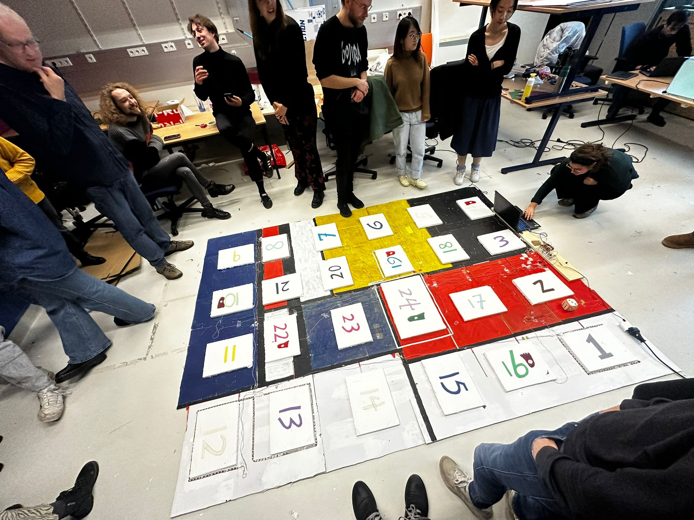
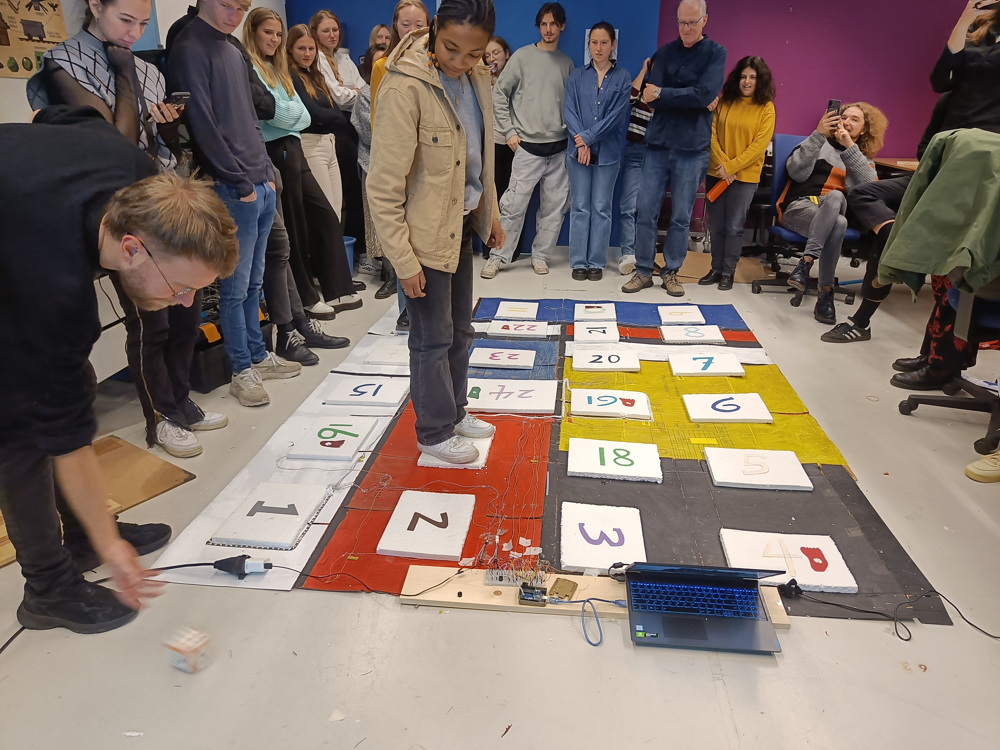
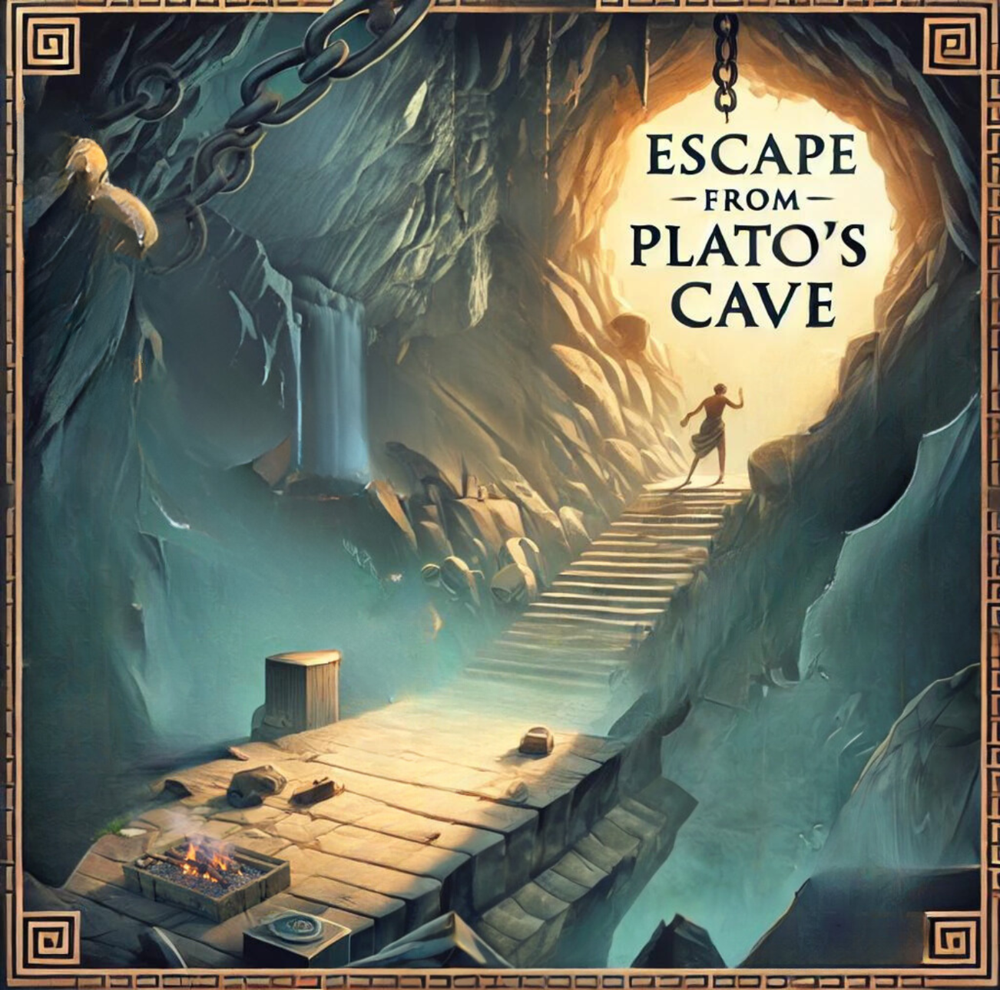
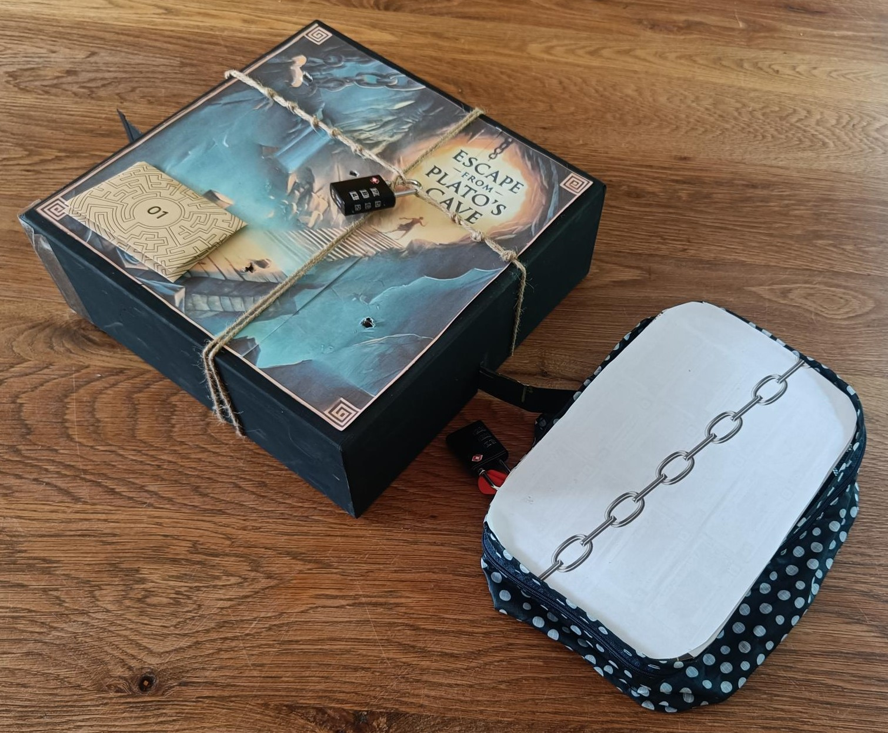

<a href="#Neurosonification" class="anchor-button">Neurosonification</a>
<a href="#GooseBoardGame" class="anchor-button">GooseBoardGame</a>
<a href="#EscapePlato" class="anchor-button">Escape from Plato's Cave</a>

<h3 id="NeuroSonification">NeuroSonification: controlling sound with your mind</h3>

Inspired by BrainBall, NeuroSonification is a game where two players control sound with mind relaxation. The project was build for the course Sound, Space and Interaction. The players are placed on opposite sites and each wear a MindWave EEG set. This set registers how relaxed the players are and based on these scores, will play a synthesized sound in the space between the participants. For this course, I learned to use PureData, a visual coding language specifically used for music generation. 

Neurosonification also got selected in June 2024 for the [YAL/YUL Science Exhibition in Leiden](https://www.universiteitleiden.nl/en/news/2024/06/unique-exhibition-translates-science-into-music-images-and-dance), where I presented my work and visitors could experience the game.

    <video height="190" controls>
        <source type="video/mp4" src="https://github.com/Linthevanrooij/portfolio/raw/refs/heads/main/images/VID_20240611213338.mp4">
        Your browser does not support HTML video.
    </video>
    
    

<h3 id="GooseBoardGame">GooseBoardGame</h3>

The game of the Goose is a typical Dutch board game in which you have to be the first to reach the
last tile of the board by throwing with a dice. In between the first and the last tiles, there are multiple
tiles corresponding to an action, such as a “bridge” or a “prison”. 

As part of the course Hardware & Physical Computing, me and two other classmates created a larger ‘real life’ version of this board game to play with real people (our classmates) as pawns, supported by sensors and actuators (LDRs, LED strips and sound effects) which are functioning as the gooses. These are registering the positions and guide the players into the directions they have to go. The interactive game was received as very enjoyable and dynamic!

    <a href="https://www.youtube.com/watch?v=Qoaznm9Rup4" class="image-overlay-link video" target="_blank">
        

        
        
View Demo Video

        

    </a>
    

<h3 id="EscapePlato">Escape From Plato's Cave</h3>

The course Science and Humanities encouraged us to translate an insight about the course into an experience. For this, I've build a portable esacpe room, in which the players are "trapped in Plato's cave". The goal? To escape from your own perspective only (Plato's Cave) and to combine knowledge to come to an overview of all perspectives (the outside world). An impression of the escape room can be found below. 

    <a href="docs/Escape_plato.pdf" class="image-overlay-link square" target="_blank">
        

        
        
View impression

        

    </a>
    

