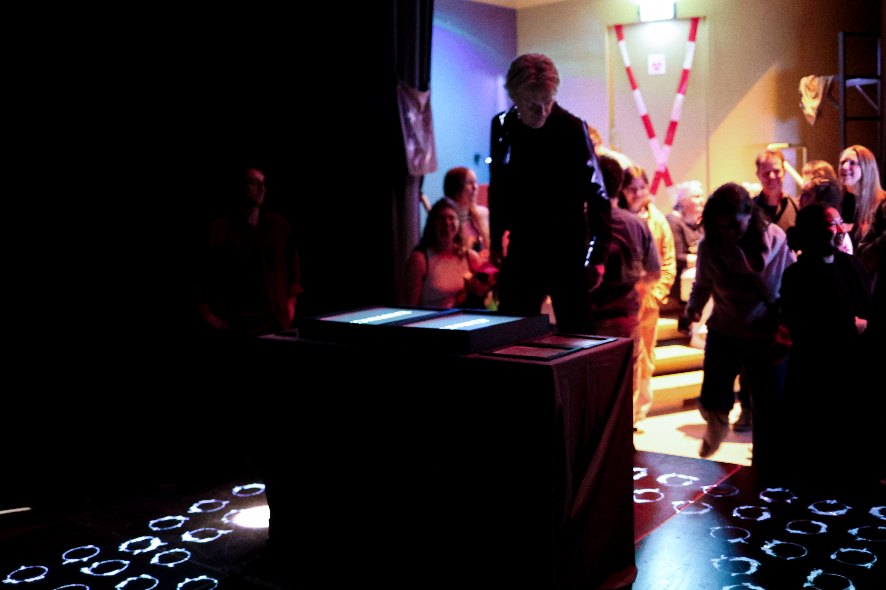
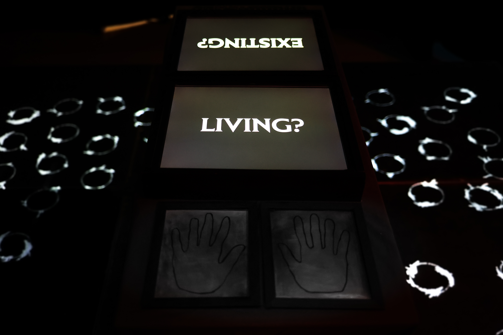
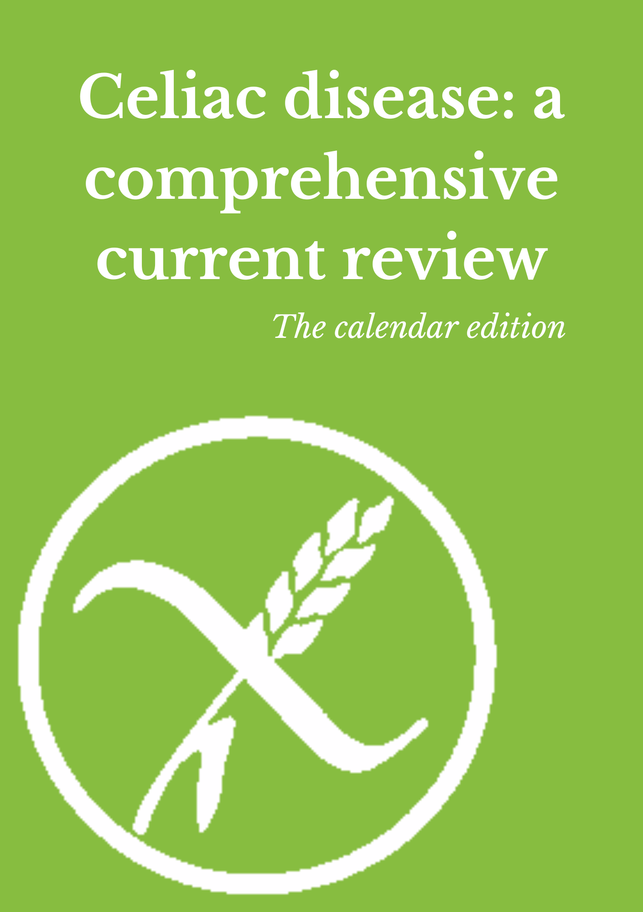

<a href="#TestifiedExistence" class="anchor-button">Testified Existence</a>
<a href="#CeliaCal" class="anchor-button">Celiac Calendar</a>
<a href="#MagicMike" class="anchor-button">Meta Magic Mike</a>

<h3 id="TestifiedExistence">Testified Existence</h3>

Together with Emma and Joseph, we exhibited our project Testified Existence during the exibition in [V2_](https://v2.nl/events/living-media-technology-exhibition). This was all part of the course Exhibition: Science to Experience. In this course we translated a statement within the theme LIVING into an experience. For us we came up with the statement *Prove that your are existing, not just living*. Our experience was focused on creating awareness of the dualism between living - existing. The video below creates a nice overview of the message that we were trying to convey. 

    <a href="https://youtu.be/op22tjlWhmM" class="image-overlay-link" target="_blank">
        

        
        
View Video

        

    </a>
    
    

<h3 id="CeliaCal">Celiac Disease: the Calendar Edition</h3>

We created a calendar for the course Playful & Creative Science, in which we presented a research article in a playful manner. 

<a href="docs/pns_cal.pdf" class="image-overlay-link" target="_blank">
    

    
    
View full calendar

    

</a>

<h3 id="MagicMike">Meta Magic Mike</h3>

The course Meta Media was spanned over only one full-time week. In this week we started with an assigned medium, which turned out to be "Magic Mike" for us. As this was quite hilarious to start with, because our teacher did not know what Magic Mike was (a stripper movie). We turned the movie, which contained indeed quite a lot of stripper scenes, into two other genres; or at least we tried to convey this into two different trailers. With this, we wanted to convey that the trailer plays an important role in setting the scene and can also be misleading...

[Link to trailers](https://www.youtube.com/playlist?list=PL_GIj9ptbndxvAcHiVHfjiGa05AzIQidJ)

