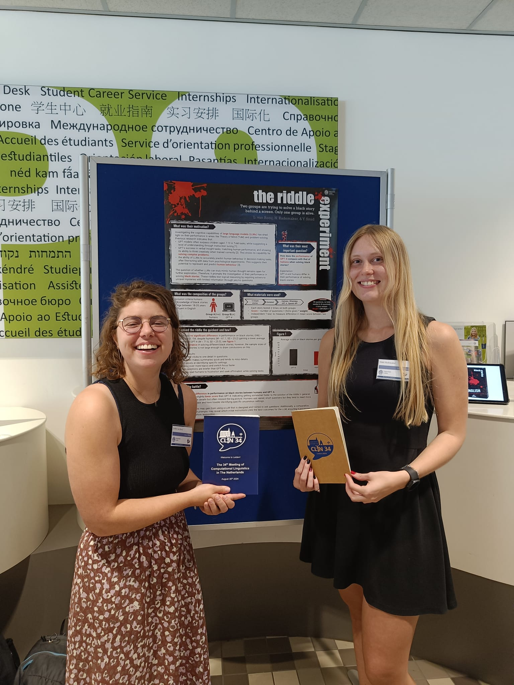
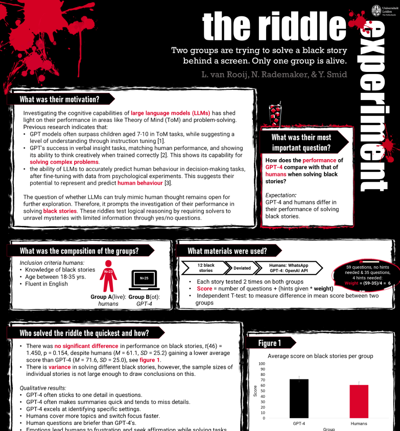

<a href="#Riddle" class="anchor-button">The Riddle Experiment</a>
<a href="#Connectionsm" class="anchor-button">Connectionism</a>
<a href="#RF" class="anchor-button">Sipping on Serotonin</a>
<a href="#FAIP" class="anchor-button">Emotion-Guided Image and Text Generation</a>
<a href="#ISE" class="anchor-button">Informal Science Education</a>

<h3 id="Riddle">The Riddle Experiment</h3>

*The Riddle Experiment: two groups are trying to solve a Black Story behind a screen, only one group is alive* was our title for our research project executed during the course Non-Human Cognition. Together with Yanna and Nikki, we set up an experiment that tested the reasoning capabilities of ChatGPT versus those of humans. We created a poster presenting our results, for which earned us the Best Poster Award!

But the story did not end here, together with our teacher Tessa Verhoef, we tranformed our research into a research paper. We presented this at the CLIN conference 2024, got published in their journal and were accepted for the Cognitive Sciences conference in San Fransisco. Unfortunately, we could not attend with our whole group, but our paper was also accepted in their proceedings (yet to be published).

    <a href="https://www.clinjournal.org/clinj/article/view/212" class="image-overlay-link" target="_blank">
        

        
        
View CLIN Article

        

    </a>
    <a href="docs/NHC_blackstory_poster_original.pdf" class="image-overlay-link" target="_blank">
        

        
        
View poster

        

    </a>

<h3 id="Connectionism">Connectionsm</h3>

I wrote two papers for the course Strategies in Creative and Performing Arts. Connectionism is a strategy in arts that I created for this course. More can be found in the documents below. 

- [Comparing artworks minimalism](docs/Minimalist_perspective.pdf.pdf)
- [Connectionism](docs/Connectionism.pdf)

<h3 id="RF">Sipping on Serotonin</h3>

For the very first course that was thaught during my masters called Research Fundamentals, we had to write an essay on a topic with only 7 existing references. I wrote an essay on how to treat depression with Ayahuasca. Interested? You can about this [here](docs/7_papers_assignment_Linthe_van_Rooij.pdf). 

<h3 id="FAIP">Emotion-Guided Image and Text Generation</h3>

One of my electives was called *Fundamentals of Artificial Intelligence Programme*, which I followed at TU Delft. It thaught me the full scope of fundaments of AI, which was very informative and interesting to learn about. Alongside the theory, we did a group project where we tested a framework that uses EEG data and a convolutional neural network to generate images and text based on human emotions. We also ran a small pilot study to see how well the generated images matched the emotions, by asking participants to guess the emotion behind each image.

[Link to the paper](docs/DeepBCI_report.pdf)

<h3 id="ISE">Informal Science Education</h3>

In this course, we visited different Science Museums such as Nemo, Museon, and Naturalis, after which we had to make assignments focused at combining theory with the experience in the museums. For Naturalis, we had to create an idea for a family activity in one of their activity rooms. Our presentation slides, including our idea can be found [here](docs/Group3_Naturalis_presentation.pdf).

