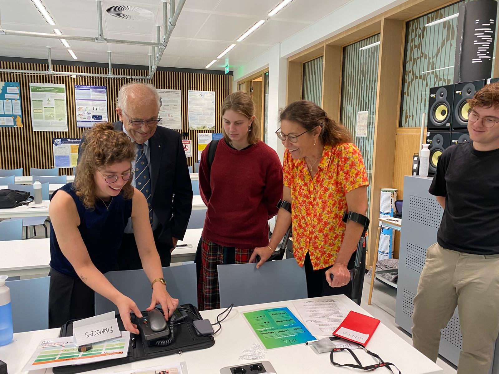
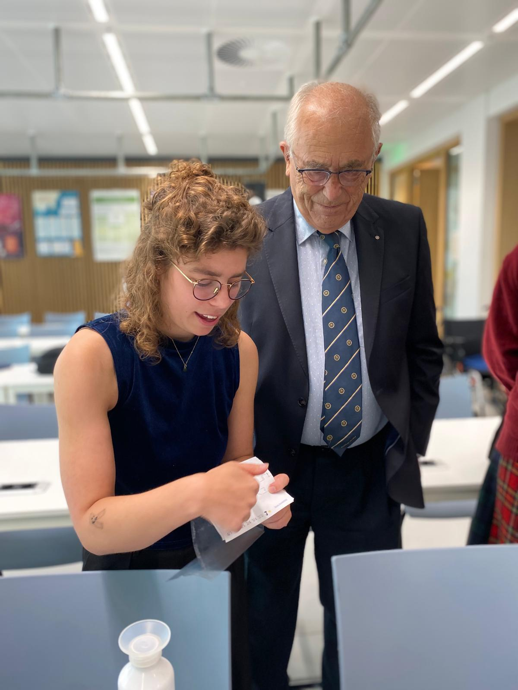
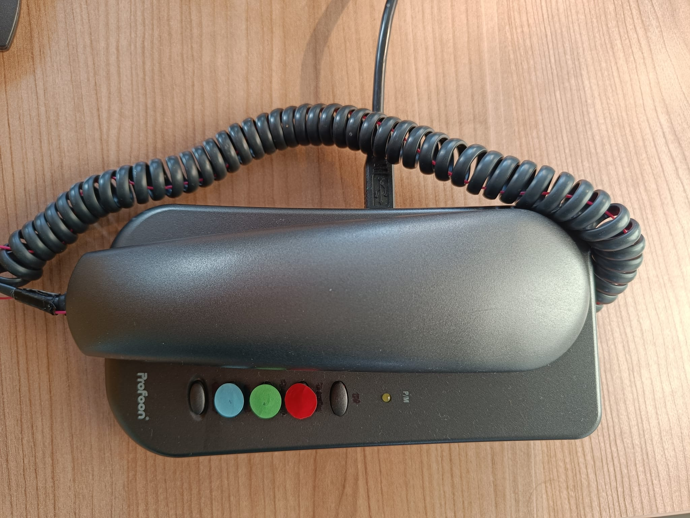

<h3>Escaping the Room, Not the Bias: Investigating the False Consensus Effect through Experiential and Observational Learning in an Educational Escape Room.</h3>

For my thesis project, I created a custum-build escape room to investigate the False Consensus Effect, a cognitive bias where people overestimate how much others share their opinions and beliefs. The whole project was actually a perfect combination of the psychology part of my previous bachelor Psychobiology and my current masters. Although the whole foundation surrounding the False Consensus Effect and learning experiences was more Social-Science focused, the process of building the actual escape room, with a mirco-controlled second-hand telephone would not have been possible without everything that I learned during my masters CRIT. 

    <a href="docs/thesis_presentation.pdf" class="image-overlay-link">
        

            
            
Presentation Slides

        

    </a>
    
    
    

The (portable) escape room was aimed to create an active learning experience about the underlying arguments surrounding the statement *Should AI replace office workers?*. An impression of the escape room can be found below. 

