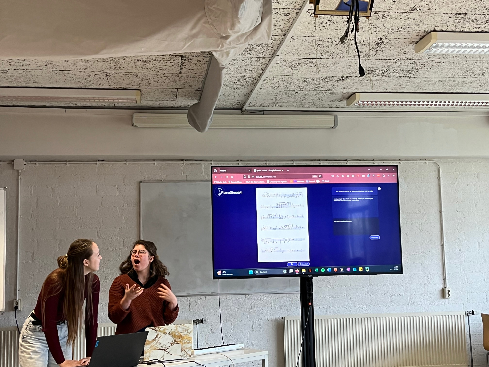
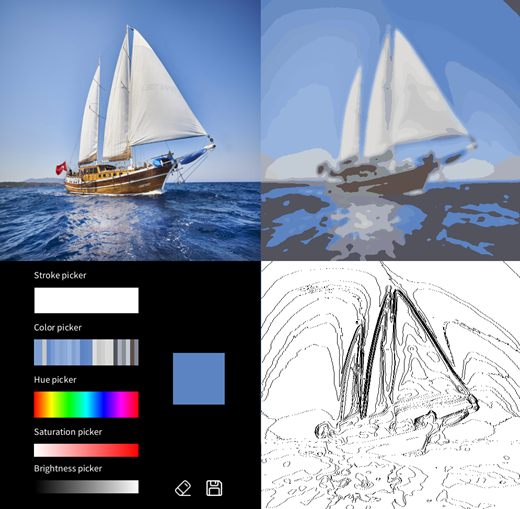
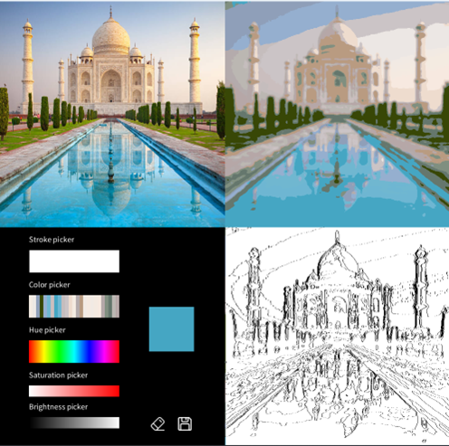
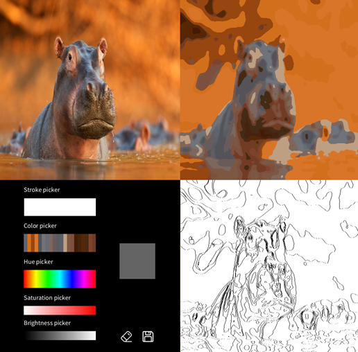

<a href="#PianoSheetAI" class="anchor-button">PianoSheetAI</a>
<a href="#JColElfjes and MochiMonsters" class="anchor-button">JColElfjes and MochiMonsters</a>
<a href="#Image2Paint" class="anchor-button">Image2Paint</a>
<a href="#GPTracker" class="anchor-button">GPTracker</a>

<h3 id="PianoSheetAI">PianoSheetAI</h3>

As part of the course HCI, me and Emma Boom built an interactive web application, that, with the help of AI, translated user input into a workable score for piano musicians! With two cycles of prototyping and testing, we finalized the tool as a pianosheet generator for musicians with a creative block. With our presentation, we received the "best presentation award"!

Later, for the course Computational Creativity, we further developed this tool into PianoSheetAI 2.0 focused on co-creativity. 

    

        <a href="https://youtu.be/e-GNHiEiJg8" class="image-overlay-link" target="_blank">
            

            
            
View Demo Video

            

        </a>
    

    
    

[link to github](https://github.com/Linthevanrooij/PianoSheetAI){:target="_blank"}

<h3 id="JColElfjes and MochiMonsters">JColElfjes and MochiMonsters</h3>

Computational Creativity had two really fun and cool assignments; a poetry generator based on grammar rules and a recipe generator based on an evolutionairy algorithm. With help of J Cole and some grammar rules, we made a poem generator that created didactic cinquains also known as "Elfjes". The recipe generator received help from web-scraped glutenfree Mochi recipes. Based on an evolutionairy algorithm, it created unique mochi recipes with sometimes weird ingredients such as olives, or pinapple with coffee. We used the latter in the traditional "bake off" with the class and received the "most surprising cookie" award for it. Have a look in our recipe book or listen to our JCole-like Elfjes. 

    <video height="190" controls>
        <source type="video/mp4" src="https://github.com/Linthevanrooij/portfolio/raw/refs/heads/main/images/VID_20240611213338.mp4">
        Your browser does not support HTML video.
    </video>
    

        <a href="docs/MochiMonsters.pdf" class="image-overlay-link square" target="_blank">
            

            
            
View Recipe Book

            

        </a>
    

[link to github](https://github.com/Linthevanrooij/Computational_creativity){:target="_blank"}

<h3 id="Image2Paint">Image2Paint</h3>

The Creative Programming Course taught me how to program in Processing, a java-based programming tool. I created a creative tool that turns any image into a colouring template, inspired by “paint by number”. A paint-by-number painting is a painting in the form of a colouring plate with tiny numbers in it, defining which colour needs to be painted where. This is something that became a famous activity during COVID-19 and is a personal hobby of mine as well. This creative tool turns any image into a printable colouring template and defines colours to paint inside the tool as well. 

[link to github](https://github.com/Linthevanrooij/Image2paint){:target="_blank"}

<h3 id="GPTracker">GreenPlanetTracker (GPTracker)</h3>

One of my elective projects was AI in Society. For the final project, we had to re-imagine what AI could be in a hopeful way within a specific domain. I chose "Environment" and build a concept idea/ prototype for a tool that tracks your GPT usage, and links this to energy and water usage, based on known data. The paper that I wrote about this topic can be found [here](docs/AISOC_final_assignment.pdf).

    <a href="docs/GreenPlanetTracker.pdf" class="image-overlay-link square" target="_blank">
        

        
        
View Demo PDF

        

    </a>

